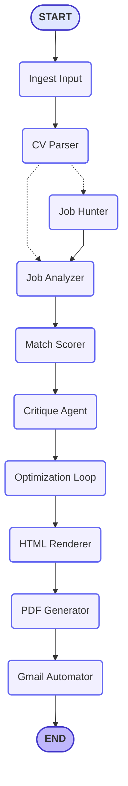

# 🚀 AI Career Automation System

A production-grade, **Multi-Agent AI pipeline** that analyzes, optimizes, and autonomously applies for jobs. It transforms a standard CV into a high-scoring, ATS-friendly document and sends it directly to hiring managers via the Gmail API.

---

## 🧠 Overview

The AI Career Automation System is a sophisticated graph-orchestrated pipeline built with **LangGraph**. It doesn't just "rewrite" text; it acts as an autonomous career assistant that:

* 📊 **Scans & Analyzes:** Evaluates CVs against job descriptions with surgical precision.
* 🧠 **Strategic Optimization:** Automatically injects missing hard skills and reframes experience to bypass ATS filters.
* 🔁 **Iterative Scoring:** Refines the CV content through a feedback loop until target match scores are met.
* 🎨 **Tailwind Design:** Renders the optimized data into a beautiful, semantic HTML layout.
* 🖨️ **Pro-Grade PDF:** Generates a professional A4 PDF using WeasyPrint.
* 📧 **Autonomous Apply:** Fetches user credentials, drafts a cover letter, and sends the application via Gmail API.

---

## 🏗 System Architecture

The system follows a strictly defined **Directed Acyclic Graph (DAG)** to ensure reliability and observability.

### 📊 Agent Flow Logic



---

## ✨ Core Features

* ✅ **Multi-Agent Orchestration:** Powered by LangGraph for deterministic state management.
* ✅ **Deep Job Scraping:** Support for Job Titles, URLs, or Raw Text.
* ✅ **ATS Match Scoring:** Uses LLM reasoning to simulate actual Applicant Tracking Systems.
* ✅ **Tailwind CSS Layouts:** CVs are rendered using modern web standards for pixel-perfect PDFs.
* ✅ **Secure Token Management:** User Gmail tokens are encrypted using AES-256-GCM to ensure privacy.
* ✅ **Observability:** Full execution tracing integrated with LangSmith.
* ✅ **Cloud-Ready:** Fully Dockerized with all necessary Linux dependencies for PDF rendering.

---

## 🛠 Tech Stack

### 🤖 Core AI

* **LangGraph & LangChain** – Orchestration
* **Google Gemini 2.5 Flash/Pro** – Reasoning engine
* **LangSmith** – Tracing and debugging

### 🗄 Backend & Database

* **FastAPI** – High-performance web API
* **Supabase** – PostgreSQL database, Auth, and Storage
* **PyCryptodome** – AES-256-GCM encryption

### 📄 PDF & Scraping

* **WeasyPrint** – Professional HTML-to-PDF engine
* **BeautifulSoup4 & DuckDuckGo Search** – Job hunting
* **PyPDF** – Structured CV parsing

---

## 📂 Project Structure

```text
AI-Career-Automation-System/
├── app/
│   ├── agents/        # Logic for specialized agents (Scorer, Optimizer, etc.)
│   ├── graph/         # LangGraph node definitions and builder
│   ├── schemas/       # Pydantic models for structured AI output
│   ├── tools/         # PDF generation and Gmail API utilities
│   ├── utils/         # AES Encryption and security helpers
│   ├── server.py      # FastAPI entry point
│   └── state.py       # Shared AgentState definition
├── Dockerfile         # Production deployment config
├── requirements.txt   # Dependencies
└── .env               # Secrets (API Keys, DB Credentials)
```

---

## ⚙️ Setup Instructions

### 1️⃣ Clone and Install

```bash
git clone https://github.com/mohamedabuhamida/AI-Career-Automation-System.git
cd AI-Career-Automation-System
python -m venv venv
source venv/bin/activate  # or venv\Scripts\activate (Windows)
pip install -r requirements.txt
```

### 2️⃣ System Dependencies (WeasyPrint)

The system requires specific libraries for PDF rendering:

* **Linux:**

  ```bash
  libcairo2 libpango-1.0-0 libpangocairo-1.0-0 libgdk-pixbuf-2.0-0 shared-mime-info
  ```
* **Windows:** Install GTK3 for Windows.

### 3️⃣ Environment Variables

Create a `.env` file:

```env
OPENAI_API_KEY=your_openai_api_key_here
GEMINI_API_KEY=your_gemini_api_key_here

LANGSMITH_TRACING=true
LANGSMITH_ENDPOINT=https://smith.langchain.com/api/v1/traces
LANGSMITH_API_KEY=your_langsmith_api_key_here
LANGSMITH_PROJECT=your_langsmith_project_name_here

API_KEY=your_secure_api_key_here

# Supabase
SUPABASE_URL=your_supabase_url_here
SUPABASE_SERVICE_ROLE_KEY=your_supabase_service_role_key_here

# Google OAuth (from Google Cloud Console)
GOOGLE_CLIENT_ID=Your_Google_Client_ID_Here
GOOGLE_CLIENT_SECRET=Your_Google_Client_Secret_Here

# Encryption (same key as database)
ENCRYPTION_KEY=your_32_byte_key_here
```

---

## 🐳 Docker Deployment

Build and run the entire system in a containerized environment:

```bash
docker build -t career-ai-backend .
docker compose up --build
```

---

## 📊 Design Principles

* 🔐 **Security First:** No plain-text tokens are stored; encryption is mandatory.
* 📑 **ATS-Ready:** Focuses on semantic HTML tags that machines can easily read.
* 🛡 **Fail-Safe:** If a company email is not found, the system sends the CV to the user's personal inbox as a backup.
* 📈 **Observability:** Every decision made by the AI is logged and traceable via LangSmith.

---

## 👨‍💻 Contributors

* Mohamed Ramadan AbuHamida
* Islam Muhammad
